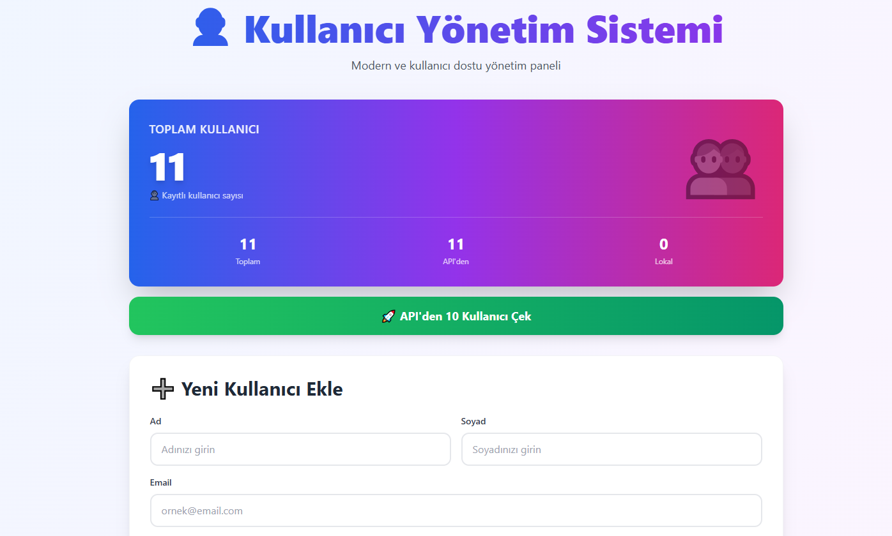
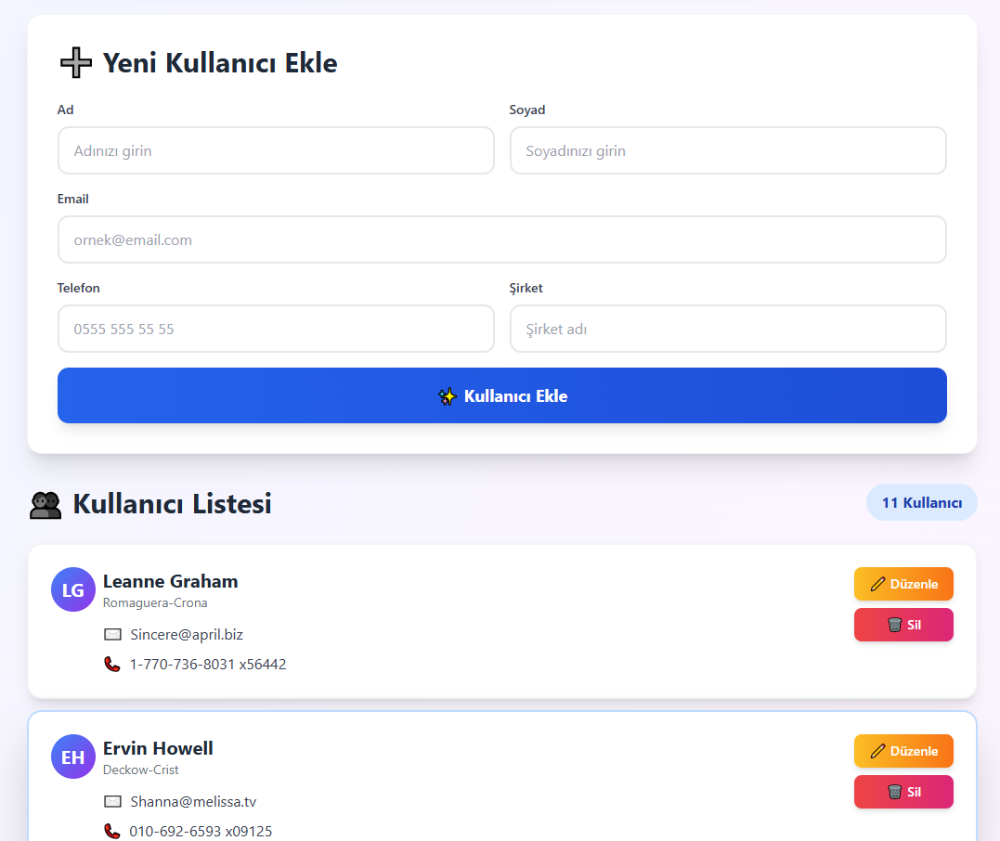

# 👤 Kullanıcı Yönetim Sistemi

Modern ve kullanıcı dostu bir web uygulaması. React ve Tailwind CSS ile geliştirilmiştir.

## 🚀 Özellikler

- ✅ **CRUD İşlemleri**: Kullanıcı ekleme, listeleme, güncelleme ve silme
- ✅ **API Entegrasyonu**: JSONPlaceholder API'den kullanıcı verisi çekme
- ✅ **LocalStorage**: Verilerin tarayıcıda kalıcı olarak saklanması
- ✅ **Responsive Tasarım**: Mobil ve masaüstü uyumlu
- ✅ **Modern UI**: Tailwind CSS ile şık ve kullanıcı dostu arayüz
- ✅ **İstatistikler**: Toplam, API'den gelen ve lokal eklenen kullanıcı sayıları

## 📸 Ekran Görüntüleri





## 🛠️ Kullanılan Teknolojiler

- **React** - UI framework
- **Tailwind CSS** - Styling
- **Vite** - Build tool
- **JSONPlaceholder API** - Fake kullanıcı verileri
- **LocalStorage** - Veri saklama

## 📦 Kurulum

### Gereksinimler

- Node.js (v18 veya üzeri)
- npm veya yarn

### Adımlar

1. **Projeyi klonlayın:**
```bash
git clone https://github.com/burakarikan17/user-management-system.git
```

2. **Proje dizinine gidin:**
```bash
cd user-management-system
```

3. **Bağımlılıkları yükleyin:**
```bash
npm install
```

4. **Geliştirme sunucusunu başlatın:**
```bash
npm run dev
```

5. **Tarayıcınızda açın:**
```
http://localhost:5173
```

## 🎯 Kullanım

### Kullanıcı Ekleme
1. Formu doldurun (Ad, Soyad, Email, Telefon, Şirket)
2. "Kullanıcı Ekle" butonuna tıklayın

### API'den Veri Çekme
1. "API'den 10 Kullanıcı Çek" butonuna tıklayın
2. JSONPlaceholder API'den 10 kullanıcı otomatik olarak eklenecektir

### Kullanıcı Düzenleme
1. Kullanıcı kartındaki "Düzenle" butonuna tıklayın
2. Açılan dialog'larda bilgileri güncelleyin

### Kullanıcı Silme
1. Kullanıcı kartındaki "Sil" butonuna tıklayın
2. Onay verin

## 📁 Proje Yapısı
```
user-management/
├── public/
├── src/
│   ├── components/
│   │   ├── UserForm.jsx      # Kullanıcı ekleme formu
│   │   ├── UserCard.jsx      # Kullanıcı kartı
│   │   ├── UserList.jsx      # Kullanıcı listesi
│   │   └── Stats.jsx         # İstatistikler
│   ├── App.jsx               # Ana component
│   ├── main.jsx              # Giriş noktası
│   └── index.css             # Tailwind CSS
├── index.html
├── package.json
├── tailwind.config.js
├── postcss.config.js
└── vite.config.js
```

## 🌐 Canlı Demo

[Demo Linki](https://your-demo-link.netlify.app) *(Netlify'a deploy ettikten sonra güncellenecek)*

## 👨‍💻 Geliştirici

**Burak Arıkan** - Yazılım Mühendisliği 2. Sınıf Öğrencisi